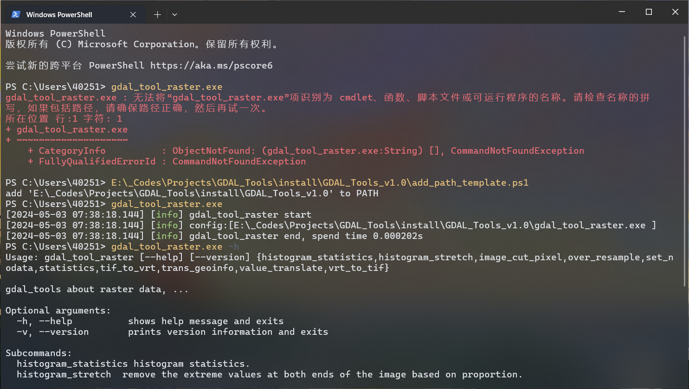
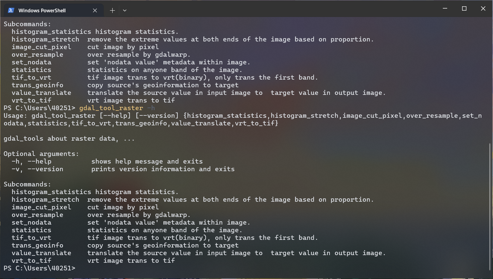
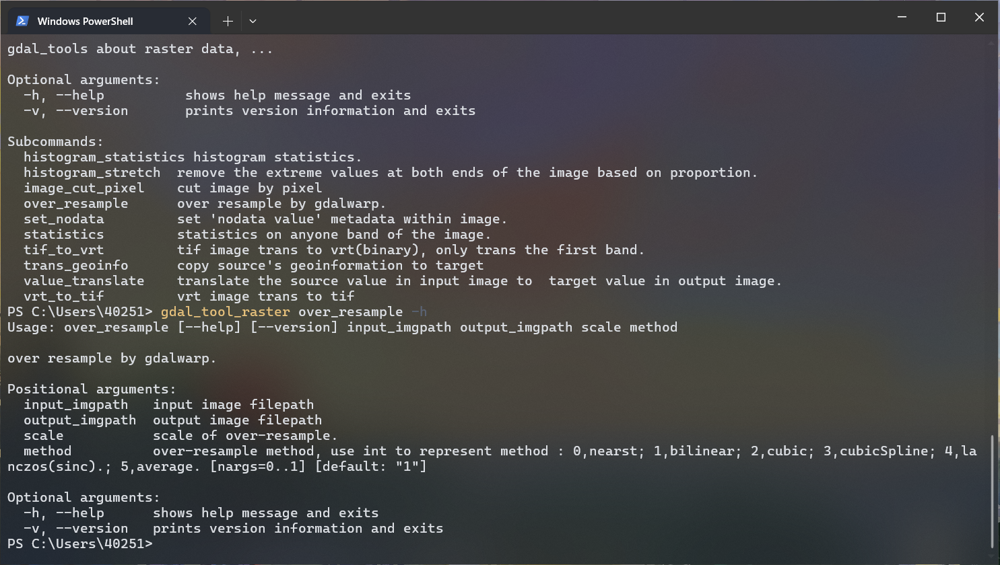
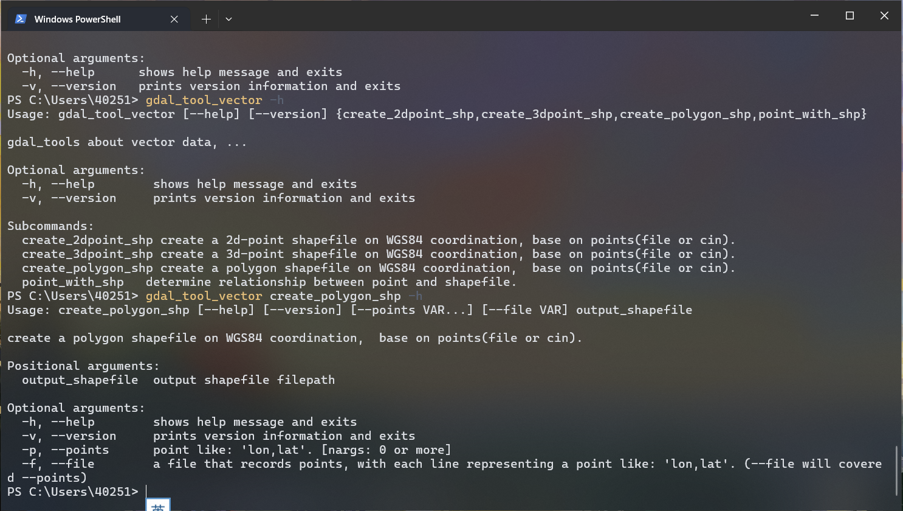

# GDAL_Tools

Collection of executable, which dependent on GDAL (and spdlog)

写一些基于GDAL的工具集，依赖GDAL和spdlog两个库

随便写写，实际使用时难免会有很多bug

## 使用方法

工具均为命令行形式启动，在命令行中输入`exe -h`，查看exe的使用方法。

### 临时添加环境变量

每次使用exe都需要输入exe的相对路径或绝对路径，这也增加了使用难度。将工具所在地址添加到环境变量是一种解决方法，但对于windows系统将过多工具添加到环境变量，又可能对其他工具的依赖环境造成困扰，所以就提供了一个将工具所在地址临时添加到环境变量的脚本`add_path_template.ps1`或`add_path_template.bat`，执行脚本后，仅当前终端添加工具地址到变量中，输入工具名称即可直接使用，并且可以通过tab补全工具，关闭后消失。

powershell使用`add_path_template.ps1`，cmd使用`add_path_template.bat`。



### gdal_tool_raster

gdal_tool_raster集成了多个与栅格图相关的工具，输入`gdal_tool_raster -h`可以查看有哪些子命令`subcommands`。



输入`gdal_tool_raster [subcommand] -h`可以查看子命令的使用方法。以`trans_geoinfo`为例，



### gdal_tool_vector

使用方法同gdal_tool_raster，不再赘述



### 其他工具

read_rgm2008, delaunay建网, DEM拼接, 获取图像在某条直线上的值..., 满足自己需求写的小工具, 不适合集成到gdal_tool_raster或gdal_tool_vector中，故以独立exe的形式存在。

这些exe暂时还没有加入argparse, 无法使用-h的方式查看使用方法。

为加入argparse的模块包括：

- unified_geoimage_merging
- get_image_value_in_line
- virtual_files_system_test

## Module

### Raster

#### 1.image_cut

图像裁剪, 使用起始点（左上角）坐标，输入需要裁剪的宽高，从原始影像中裁剪新影像。

#### 2.resample

基于GDALWarp的重采样，可以选择多种插值方法。

#### 3.set_nodata

在影像的metadata中添加`NODATA_VALUE=val`字段，arcmap10.8及以上版本可以正常识别该字段并将NODATA数据显示为透明色。

#### 4.stat_hist

统计影像的直方图分布特征。

（会更新\[image].aux.xml文件）

#### 5.stat_minmax

统计影像的最大最小值，平均值，以及方差。

（会更新\[image].aux.xml文件）

#### 6.stretch_hist

基于直方图的影像拉伸。（去除两端一定百分比的极值）

#### 7.tif2vrt

tif图转vrt（头文件+二进制文件），可以设置二进制文件的存储类型，MSB或LSB。

>MSB:大端存储，linux系统二进制文件的默认存储方法
>LSB:小端存储，windows系统二进制文件的默认存储方法

搭配vrt文件，任意存储类型均可以正常被GDAL库读取。

#### 8.vrt2tif

vrt文件转tif图。

#### 9.trans_geo

将参考影像的坐标系统传递给目标影像，包括坐标系统和六参数。

#### 10.trans_val

将参考影像中的指定数值替换为目标数值。

### Vector

#### 1.point_with_shp

计算一个点与shp的拓扑关系，输入一个点平面坐标，一个shp文件，文字形式输出点与shp文件的关系(in or out)

#### 2.create_polygon_shp

使用点信息，创建一个多边形shp

#### 3.create_2dpoint_shp

使用平面点信息，创建一个二维点状shp，并`ID`字段，记录点的索引值。

#### 4.create_3dpoint_shp

使用三维点信息，创建一个二维点状shp，并`ID`和附有`VAL`字段，分别记录点索引值和第三维度信息。

### Other

#### 1.create delaunay

提供二维点文件, 创建delaunay三角网，输出所有三角形的坐标

#### 2.read_egm2008

通过egm2008，输出单点经纬度，或经纬度文件，或带地理坐标的DEM文件，输入小端存储（*_SE）的EGM2008文件,输出对应点或范围的高程异常值

#### 3.unified_GeoImage_merging

统一坐标系统的影像的拼接，例如全球分块的DEM文件。

以DEM为例，输入所有DEM文件所在的<**根目录**>（允许多层级迭代），再输入一个目标区域的<**shp文件**>，选择拼接方法

拼接方法有两种，

minimum表示只提取与shp有交集的DEM数据进行拼接，当shp文件不规则时可能会出现拼接结果边角缺少数据的情况；

maximum表示提取所有在shp文件四至范围内的DEM数据进行拼接，所以拼接结果将会是一个完整的矩形（除非缺少DEM数据）但也会失去shp的形状特点；

程序默认<**根目录**>内所有DEM都在统一坐标系统内，并且分辨率完全相同，即没有进行重采样等操作，而是直接计算每个待拼接DEM在拼接后DEM的起始位置，直接将所有像素值“平移”过去。

当<**根目录**>内存在两种及以上坐标系统的影像且均被用于拼接，或与shp文件坐标系统不相同时，可能会出现输出影像尺寸离谱、无法正确判断相交情况等各种奇奇怪怪的异常问题。

考虑到<**根目录**>中可能存在除DEM之外的无效数据，程序内也提供了基于文件名称的正则表达式筛选条件（可选），仅将通过了正则筛选的数据作为拼接待选数据。

TDM1_DEM的文件结构为：

```powershell
D:.
│  demProduct.xsd
│  generalHeader.xsd
│  TDM1_DEM__30_N39E112.xml
│  types_inc.xsd
│
├─AUXFILES
│      TDM1_DEM__30_N39E112_AM2.tif
│      TDM1_DEM__30_N39E112_AMP.tif
│      TDM1_DEM__30_N39E112_COM.tif
│      TDM1_DEM__30_N39E112_COV.tif
│      TDM1_DEM__30_N39E112_HEM.tif
│      TDM1_DEM__30_N39E112_LSM.tif
│      TDM1_DEM__30_N39E112_WAM.tif
│
├─DEM
│      TDM1_DEM__30_N39E112_DEM.tif
│
└─PREVIEW
        TDM1_DEM__30_N39E112.kml
        TDM1_DEM__30_N39E112_AM2.kml
        TDM1_DEM__30_N39E112_AM2_QL.tif
        TDM1_DEM__30_N39E112_AMP.kml
        TDM1_DEM__30_N39E112_AMP_QL.tif
        TDM1_DEM__30_N39E112_COM.kml
        TDM1_DEM__30_N39E112_COM_LEGEND_QL.png
        TDM1_DEM__30_N39E112_COM_QL.tif
        TDM1_DEM__30_N39E112_COV.kml
        TDM1_DEM__30_N39E112_COV_LEGEND_QL.png
        TDM1_DEM__30_N39E112_COV_QL.tif
        TDM1_DEM__30_N39E112_DEM.kml
        TDM1_DEM__30_N39E112_DEM_ABS_QL.tif
        TDM1_DEM__30_N39E112_DEM_LEGEND_QL.png
        TDM1_DEM__30_N39E112_DEM_QL.tif
        TDM1_DEM__30_N39E112_DEM_THUMB_QL.png
        TDM1_DEM__30_N39E112_DEM_WAM_ABS_QL.tif
        TDM1_DEM__30_N39E112_DEM_WAM_QL.tif
        TDM1_DEM__30_N39E112_HEM.kml
        TDM1_DEM__30_N39E112_HEM_LEGEND_QL.png
        TDM1_DEM__30_N39E112_HEM_QL.tif
        TDM1_DEM__30_N39E112_LSM.kml
        TDM1_DEM__30_N39E112_LSM_LEGEND_QL.png
        TDM1_DEM__30_N39E112_LSM_QL.tif
        TDM1_DEM__30_N39E112_WAM.kml
        TDM1_DEM__30_N39E112_WAM_LEGEND_QL.png
        TDM1_DEM__30_N39E112_WAM_QL.tif
```

TDM_DEM文件中有很多tif数据，但只有DEM数据的后缀名称是“xxxx_DEM.tif”，所以使用正则表达式`.*DEM.tif$`可以从中筛选出DEM数据。

## 更新日志

### 2024.05.03

增加了argparse库, 使终端的命令输入模式更加规范。

删除了部分测试项的功能模块, 将部分与栅格相关的模块整合到gdal_tool_raster中，将部分与矢量文件相关的模块整合到gdal_tool_vector中。

部分特殊的模块，如read_egm2008, geoimage_merging等, 暂时已单独模块的形式存在。

gdal_tool_raster和gdal_tool_vector两个集合，可以使用`gdal_tool_raster -h`指令查看使用方法，使用`gdal_tool_vector \[sub_module\] -h`指令查看二级模块的使用方法。

### 2024.05.05

简化了gdal_tool_raster工具部分子命令的拼写

### 2024.05.06

更新README.md
